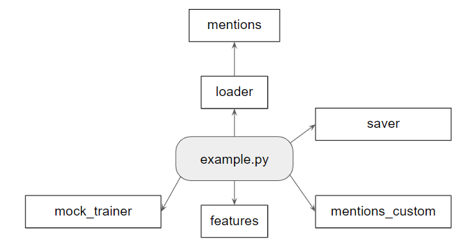

# conll2012_boilerplate
Generic code for reading/writing data for the 
<a ref="http://conll.cemantix.org/2012/">CoNLL 2012 Coreference Shared Task</a>

# CoNLL Dataset
The first part of this project is to get the official dataset. Due to copyright it was split in two parts: one can 
be easily downloaded and the other must be downloaded from the LDC site. 
<a href="http://conll.cemantix.org/2012/data.html">More here</a>.
After downloading the files, run the scripts as indicated in the page. The folder structure is a little confusing, but
makes sense for this task.

## Downloading from LDC
The files that are needed are the following:

| LDC Catalog ID | Corpus Name             | File                             |
| -------------- | ----------------------- | -------------------------------- |
| LDC2013T19     | OntoNotes Release 5.0   | ontonotes-release-5.0_LDC2013T19 |
| LDC2012T13     | English Web Treebank    | LDC2012T13.tgz                   |
| LDC2012E74     | CoNLL 2012 Test Set     | LDC2012E74.tgz                   |
| LDC2012E48     | CoNLL 2012 Training Set | LDC2012E48                       |

To download this files you must register on <a href="htts://catalog.ldc.upenn.edu">LDC website</a> and request the 
dataset. If you are linked to a university, search for it. Maybe they already have access. Use this 
<a href="https://catalog.ldc.upenn.edu/LDC2013T19">link</a> to guide you.

# Preparing spacy
The default implementation uses <a href='https://spacy.io/'>spaCy</a> to extract some base information. Run the code 
below once to download what is needed
  
python -m spacy download en_core_web_lg

# Modeling
The modules are related in the following fashion:

Although the examples.py files is not a real module, it shows how the examples group together to use the framework.

The classes used are
 

# Running tests
python -m unittest on root folder

# Extending the framework
There are at least three parts that can be extended in this framework:
* mention data
* mention pair data
* features
This extension is done by passing different methods to the <b>loader.trainfile_to_vectors</b>
The file example.py shows how these methods can be passed and have a pointer to how to implement 
custom code

## Mention data
Passing a method as the parameter increment_mention to the <b>loader.trainfile_to_vectors</b> will allow the user to 
modify/add new attributes to the Mention class.
This method receives a mention and has no return (it has to change the given instance).
One example of this implementation is the method found in <b>mentions_custom.increment_mention</b>

## Mention Pair data
As the mention data, passing a method as parameter increment_mention_pair will allow the user to 
change the mention pair. The method also only receives a MentionPair instance and the method should change the given 
instance. An example is provided in <b>mentions_custom.increment_mention_pair</b>

## Features
As each algorithm will need its own set of features, this framework must provide a generic way to create features from 
the mention pair. As long as the algorithm can work with a single vector of numbers for each example, the framework can
help with this. 
If the data is actually a tensor, one suggestion is to reshape it into a vector in this method and than make the reader
algorithm reshape it back.
The current implementation already gives a lot of features based on the the mentions and it may or may not be used by 
users. The current implementation is the <b>features.make_vectors</b> method. 

# Saving predictions
Once your program does a prediction for the CoNLL task, it must generate the output file in a speficir format so the 
submission system can evaluate it. The program can be downloaded from 
<a href="http://conll.cemantix.org/2012/download/submission/conll-2012-submissions.tar.gz">here</a>. 
You can use the method saver.save_document to create this file.
This method receives a saver.Document object. This object can be created by adding clusters to it. A cluster in this 
representation is a map of start_line:end_line for each mention in the cluster. Add one map for each cluster.
The method also receives the original path so it can build the file with line skipping and header/footer in the propper 
format. The original file does not need the mention annotation.   
